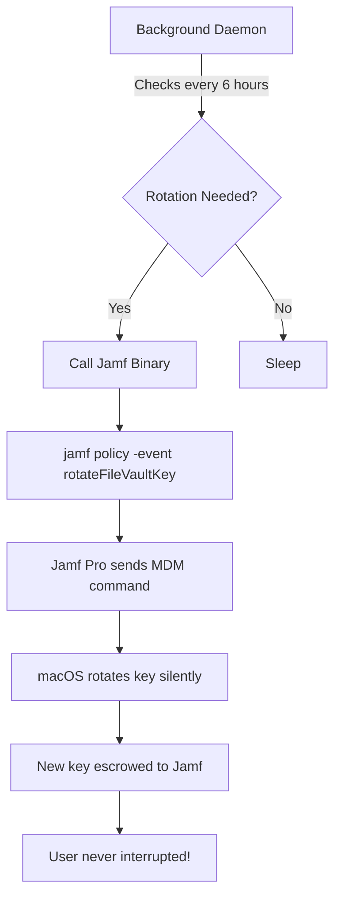

# Escrow Buddy Enhanced - Jamf Pro Setup Guide

## 🚀 Automatic FileVault Key Rotation WITHOUT User Logout

This guide shows how to configure Escrow Buddy Enhanced with Jamf Pro to rotate FileVault recovery keys automatically in the background - **no user interaction required!**

## Table of Contents
1. [How It Works](#how-it-works)
2. [Prerequisites](#prerequisites)
3. [Jamf Pro Configuration](#jamf-pro-configuration)
4. [Package Deployment](#package-deployment)
5. [Configuration Profile](#configuration-profile)
6. [Testing](#testing)
7. [Monitoring](#monitoring)
8. [Troubleshooting](#troubleshooting)

## How It Works



**Key Points:**
- No user logout required
- No passwords stored or needed
- Completely silent operation
- Full audit trail in Jamf Pro

## Prerequisites

### Required in Jamf Pro:
1. ✅ FileVault configuration profile deployed
2. ✅ Computers enrolled and communicating
3. ✅ FileVault already enabled on target Macs

### Required on Client Macs:
1. ✅ macOS 11.0 or later
2. ✅ Jamf binary installed (`/usr/local/bin/jamf`)
3. ✅ Valid Jamf Pro enrollment

## Jamf Pro Configuration

### Step 1: Create the Rotation Policy

1. Navigate to **Computers → Policies → New**

2. Configure the policy:
   ```
   Display Name: FileVault Key Rotation - Auto
   Enabled: Yes
   Trigger: Custom Event
   Custom Event: rotateFileVaultKey
   Execution Frequency: Ongoing
   ```

3. Add **Disk Encryption** payload:
   - Action: **Remediate FileVault Individual Recovery Key**
   - This uses Jamf's MDM command to rotate the key

4. Add **Scripts** payload (optional):
   ```bash
   #!/bin/bash
   # Log rotation event
   echo "$(date): FileVault key rotation triggered" >> /var/log/escrow_buddy.log
   
   # Update EA for tracking
   defaults write /Library/Preferences/com.macjediwizard.Escrow-Buddy-Enhanced LastRotation -date "$(date)"
   ```

5. **Scope**:
   - Target: All Computers with FileVault Enabled
   - Or create Smart Group: "FileVault Keys Older Than 90 Days"

6. Click **Save**

### Step 2: Create Extension Attribute (Optional but Recommended)

This EA tracks key age for Smart Groups:

1. **Settings → Computer Management → Extension Attributes → New**

2. Configure:
   ```
   Display Name: FileVault Key Age (Days)
   Data Type: Integer
   Input Type: Script
   ```

3. Script:
   ```bash
   #!/bin/bash
   
   # Check if plist exists
   PLIST="/Library/Preferences/com.macjediwizard.Escrow-Buddy-Enhanced.plist"
   if [ ! -f "$PLIST" ]; then
       echo "<result>Unknown</result>"
       exit 0
   fi
   
   # Get last rotation date
   LAST_ROTATION=$(defaults read "$PLIST" LastRotation 2>/dev/null)
   
   if [ -z "$LAST_ROTATION" ]; then
       # No rotation recorded, check FileVault enable date
       echo "<result>999</result>"
   else
       # Calculate days since rotation
       ROTATION_EPOCH=$(date -jf "%Y-%m-%d %H:%M:%S %z" "$LAST_ROTATION" +%s 2>/dev/null)
       CURRENT_EPOCH=$(date +%s)
       DAYS_OLD=$(( ($CURRENT_EPOCH - $ROTATION_EPOCH) / 86400 ))
       echo "<result>$DAYS_OLD</result>"
   fi
   ```

### Step 3: Create Smart Group for Rotation Targets

1. **Computers → Smart Computer Groups → New**

2. Configure:
   ```
   Name: FileVault Keys Need Rotation
   Criteria:
   - FileVault Status is Enabled
   - FileVault Key Age (Days) greater than 90
   - Last Check-in less than 1 day ago
   ```

3. Create policy scoped to this Smart Group that runs the rotation

## Package Deployment

### Step 1: Build the Package

```bash
# Create package structure
mkdir -p /tmp/EscrowBuddyEnhanced/Library/Security/SecurityAgentPlugins
mkdir -p /tmp/EscrowBuddyEnhanced/Library/LaunchDaemons
mkdir -p /tmp/EscrowBuddyEnhanced/scripts

# Copy bundle
cp -R "release/Escrow Buddy Enhanced.bundle" \
    /tmp/EscrowBuddyEnhanced/Library/Security/SecurityAgentPlugins/

# Create LaunchDaemon
cat > /tmp/EscrowBuddyEnhanced/Library/LaunchDaemons/com.macjediwizard.EscrowBuddyDaemon.plist << 'EOF'
<?xml version="1.0" encoding="UTF-8"?>
<!DOCTYPE plist PUBLIC "-//Apple//DTD PLIST 1.0//EN" "http://www.apple.com/DTDs/PropertyList-1.0.dtd">
<plist version="1.0">
<dict>
    <key>Label</key>
    <string>com.macjediwizard.EscrowBuddyDaemon</string>
    <key>ProgramArguments</key>
    <array>
        <string>/Library/Security/SecurityAgentPlugins/Escrow Buddy Enhanced.bundle/Contents/MacOS/EscrowBuddyDaemon</string>
    </array>
    <key>RunAtLoad</key>
    <true/>
    <key>KeepAlive</key>
    <true/>
    <key>StandardErrorPath</key>
    <string>/var/log/escrowbuddy-daemon-error.log</string>
    <key>StandardOutPath</key>
    <string>/var/log/escrowbuddy-daemon.log</string>
    <key>StartInterval</key>
    <integer>21600</integer> <!-- Check every 6 hours -->
</dict>
</plist>
EOF

# Create postinstall script
cat > /tmp/EscrowBuddyEnhanced/scripts/postinstall << 'EOF'
#!/bin/bash

# Setup authorization database
/Library/Security/SecurityAgentPlugins/Escrow\ Buddy\ Enhanced.bundle/Contents/Resources/AuthDBSetup.sh

# Load daemon
launchctl load /Library/LaunchDaemons/com.macjediwizard.EscrowBuddyDaemon.plist

# Set initial configuration
defaults write /Library/Preferences/com.macjediwizard.Escrow-Buddy-Enhanced EnableAutoRotation -bool true
defaults write /Library/Preferences/com.macjediwizard.Escrow-Buddy-Enhanced MDMType -string "JamfPro"
defaults write /Library/Preferences/com.macjediwizard.Escrow-Buddy-Enhanced JamfRotationMethod -string "policy"

exit 0
EOF

chmod +x /tmp/EscrowBuddyEnhanced/scripts/postinstall

# Build package
pkgbuild --root /tmp/EscrowBuddyEnhanced \
         --scripts /tmp/EscrowBuddyEnhanced/scripts \
         --identifier com.macjediwizard.EscrowBuddyEnhanced \
         --version 1.0.0 \
         --ownership recommended \
         EscrowBuddyEnhanced-1.0.0.pkg
```

### Step 2: Upload to Jamf Pro

1. **Settings → Computer Management → Packages → New**
2. Upload `EscrowBuddyEnhanced-1.0.0.pkg`
3. Set Category: "Security"

### Step 3: Create Deployment Policy

1. **Computers → Policies → New**
2. Name: "Deploy Escrow Buddy Enhanced"
3. Trigger: Recurring Check-in
4. Packages: Add `EscrowBuddyEnhanced-1.0.0.pkg`
5. Scope: Test computers first, then production

## Configuration Profile

Deploy settings via Configuration Profile:

1. **Computers → Configuration Profiles → New**
2. Name: "Escrow Buddy Enhanced Settings"
3. Add **Application & Custom Settings** payload:

```xml
<?xml version="1.0" encoding="UTF-8"?>
<!DOCTYPE plist PUBLIC "-//Apple//DTD PLIST 1.0//EN" "http://www.apple.com/DTDs/PropertyList-1.0.dtd">
<plist version="1.0">
<dict>
    <key>PayloadContent</key>
    <array>
        <dict>
            <key>PayloadDisplayName</key>
            <string>Escrow Buddy Enhanced</string>
            <key>PayloadIdentifier</key>
            <string>com.macjediwizard.Escrow-Buddy-Enhanced</string>
            <key>PayloadType</key>
            <string>com.macjediwizard.Escrow-Buddy-Enhanced</string>
            <key>PayloadUUID</key>
            <string>$(uuidgen)</string>
            <key>PayloadVersion</key>
            <integer>1</integer>
            
            <!-- Core Settings -->
            <key>EnableAutoRotation</key>
            <true/>
            <key>EnableBackgroundDaemon</key>
            <true/>
            
            <!-- MDM Settings -->
            <key>MDMType</key>
            <string>JamfPro</string>
            <key>JamfRotationMethod</key>
            <string>policy</string>
            
            <!-- Rotation Policy -->
            <key>RotationIntervalDays</key>
            <integer>90</integer>
            <key>MaxKeyAge</key>
            <integer>365</integer>
            <key>MinimumKeyAge</key>
            <integer>7</integer>
            
            <!-- Compliance -->
            <key>ComplianceStandard</key>
            <string>NIST</string>
            <key>EnableComplianceChecking</key>
            <true/>
            
            <!-- Monitoring -->
            <key>EnableNotifications</key>
            <false/> <!-- Silent operation -->
            <key>EnableLogging</key>
            <true/>
            <key>LogLevel</key>
            <string>Info</string>
        </dict>
    </array>
</dict>
</plist>
```

## Testing

### Initial Test - Manual Trigger

```bash
# SSH to test Mac
ssh admin@testmac.local

# Verify Jamf enrollment
sudo jamf checkJSSConnection

# Test rotation policy manually
sudo jamf policy -event rotateFileVaultKey

# Check logs
log stream --predicate 'subsystem == "com.macjediwizard.Escrow-Buddy-Enhanced"'
```

### Verify Background Rotation

```bash
# Force daemon to check now
sudo killall -USR1 EscrowBuddyDaemon

# Watch logs in real-time
log stream --predicate 'process == "EscrowBuddyDaemon"'

# Check rotation history
sudo defaults read /Library/Preferences/com.macjediwizard.Escrow-Buddy-Enhanced RotationHistory
```

### Verify in Jamf Pro Console

1. Navigate to computer record
2. Check **Disk Encryption** tab
3. Verify:
   - Recovery Key: Present
   - Key Escrow Date: Updated
   - Individual Recovery Key Validated: Yes

## Monitoring

### Create Jamf Pro Reports

1. **Advanced Computer Search**:
   - Criteria: FileVault Key Age > 90 days
   - Display: Computer Name, Key Age, Last Check-in
   - Save as: "Overdue FileVault Rotations"

2. **Dashboard Widget**:
   - Type: Computer Group
   - Group: FileVault Keys Need Rotation
   - Shows count of Macs needing rotation

### Log Aggregation

Collect logs from all Macs:

```bash
# Extension Attribute for last rotation
#!/bin/bash
LOG="/var/log/escrowbuddy-daemon.log"
if [ -f "$LOG" ]; then
    LAST_ROTATION=$(grep "rotation completed successfully" "$LOG" | tail -1)
    echo "<result>$LAST_ROTATION</result>"
else
    echo "<result>No rotation log found</result>"
fi
```

## Troubleshooting

### Issue: Rotation Not Triggering

1. **Check Jamf connection**:
   ```bash
   sudo jamf checkJSSConnection
   sudo jamf manage
   ```

2. **Verify policy exists**:
   ```bash
   sudo jamf policy -event rotateFileVaultKey -verbose
   ```

3. **Check daemon status**:
   ```bash
   sudo launchctl list | grep EscrowBuddyDaemon
   ps aux | grep EscrowBuddyDaemon
   ```

### Issue: Key Not Escrowing

1. **Verify FileVault profile**:
   ```bash
   profiles show -type configuration | grep FileVault
   ```

2. **Check escrow capability**:
   ```bash
   sudo fdesetup status
   sudo fdesetup showdeferralinfo
   ```

3. **Force escrow**:
   ```bash
   sudo jamf policy -trigger escrowFileVaultKey
   ```

### Issue: Daemon Not Running

```bash
# Reload daemon
sudo launchctl unload /Library/LaunchDaemons/com.macjediwizard.EscrowBuddyDaemon.plist
sudo launchctl load /Library/LaunchDaemons/com.macjediwizard.EscrowBuddyDaemon.plist

# Check logs
tail -f /var/log/escrowbuddy-daemon.log
tail -f /var/log/escrowbuddy-daemon-error.log
```

## Best Practices

### 1. Staged Deployment
- Test on IT Macs first
- Deploy to pilot group
- Monitor for 1 week
- Full deployment

### 2. Rotation Schedule
- Standard: 90 days
- High Security: 30 days
- Compliance (PCI-DSS): 90 days
- After recovery use: Immediate

### 3. Monitoring
- Daily: Check failed rotations
- Weekly: Review rotation reports
- Monthly: Audit compliance

### 4. Documentation
- Document custom trigger name
- Keep rotation policy updated
- Train help desk on logs

## Summary

With this configuration:
- ✅ Keys rotate automatically every 90 days
- ✅ No user logout required
- ✅ No passwords needed
- ✅ Full audit trail in Jamf Pro
- ✅ Compliance reporting built-in
- ✅ Silent operation - users never know!

This is true "set and forget" FileVault key management!