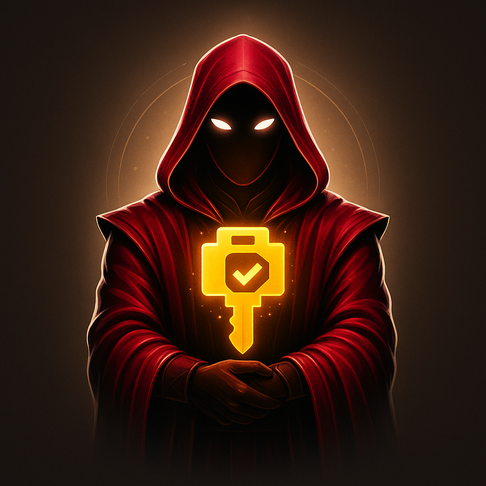

<p align="center">
  
</p>

# Escrow Buddy Enhanced
## Enterprise FileVault Key Management with Automatic Rotation

**The ONLY FileVault key rotation solution that works WITHOUT user logout!**

[](https://github.com/MacJediWizard/escrow-buddy-enhanced/releases)
[](https://www.apple.com/macos/)
[](LICENSE)

### 📚 Quick Links
[**Why Enhanced?**](#-the-problem-we-solve) | [**Features**](#-what-makes-us-enhanced) | [**Jamf Setup**](JAMF_SETUP_GUIDE.md) | [**Documentation**](Documentation/) | [**Support**](#support)

> **Note**: This is an enhanced fork of the original [Escrow Buddy](https://github.com/macadmins/escrow-buddy) created by Netflix Client Systems Engineering. See [CREDITS.md](CREDITS.md) for full attribution and acknowledgments.

## 🎯 The Problem We Solve

The original Escrow Buddy requires users to **logout and login** to rotate FileVault keys - disrupting work and requiring user cooperation. 

**Escrow Buddy Enhanced solves this with true automatic rotation:**

### ✨ Key Enhancements Over Original

- **🚀 Background Daemon** - Rotates keys silently without ANY user interaction
- **⏰ Scheduled Rotation** - Set it and forget it (30, 60, 90 days - your choice)
- **🔐 Jamf Binary Method** - No API credentials to manage or secure
- **📊 Enterprise Compliance** - Automated reports for NIST, ISO27001, PCI-DSS, HIPAA, SOC2
- **🔄 Smart Rotation** - Coordinates between daemon and auth plugin to prevent conflicts
- **🔑 Recovery Key Detection** - Automatically rotates after recovery key is used
- **📝 Audit Everything** - Complete chain of custody for every key rotation

### Why This Matters

- **IT Teams**: Deploy once, never chase users to logout again
- **Security Teams**: Guaranteed compliance without manual intervention  
- **End Users**: Zero disruption to their workflow
- **Auditors**: Complete automated compliance reporting

For background on the FileVault escrow challenge, see [Netflix's original blog post](https://netflixtechblog.com/escrow-buddy-an-open-source-tool-from-netflix-for-remediation-of-missing-filevault-keys-in-mdm-815aef5107cd).


---

## Requirements

- Your managed Macs must:
    - be enrolled in an MDM
    - have macOS Mojave 10.14.4 or newer
- Your MDM must:
    - support FileVault recovery key escrow
    - deploy a configuration profile with the [FDERecoveryKeyEscrow](https://developer.apple.com/documentation/devicemanagement/fderecoverykeyescrow) payload
    - have the ability to install packages and run shell scripts

**NOTE**: Escrow Buddy Enhanced only works with MDM-based escrow solutions, not escrow servers like Crypt Server or Cauliflower Vest.

---

## 🚀 What Makes Us Enhanced?

Unlike the original Escrow Buddy that requires user logout, **Escrow Buddy Enhanced** rotates keys automatically in the background:

| Feature | Original Escrow Buddy | Escrow Buddy Enhanced |
|---------|----------------------|----------------------|
| **Key Rotation** | Requires user logout/login | ✅ **Automatic background rotation** |
| **User Disruption** | User must logout | ✅ **Zero user interaction** |
| **Scheduling** | Manual trigger only | ✅ **Automated scheduling** |
| **Rotation After Use** | Not supported | ✅ **Auto-rotate when recovery key used** |
| **Compliance** | Basic logging | ✅ **Full compliance reporting** |
| **Jamf Integration** | Basic escrow | ✅ **Native Jamf binary support** |

## Deployment

### Quick Start with Jamf Pro (Recommended)

1. **Deploy the Enhanced package via Jamf**
   ```bash
   # Package includes both auth plugin AND background daemon
   # Daemon enables rotation WITHOUT logout!
   ```

2. **Configure automatic rotation** (no user interaction needed!)
   ```bash
   # Enable background rotation - happens automatically!
   defaults write /Library/Preferences/com.netflix.Escrow-Buddy AutoRotationEnabled -bool true
   defaults write /Library/Preferences/com.netflix.Escrow-Buddy RotationIntervalDays -int 90
   ```

3. **For Jamf users - Use the binary method** (no API credentials needed!)
   ```bash
   # Configure to use Jamf binary instead of API
   defaults write /Library/Preferences/com.netflix.Escrow-Buddy UseJamfBinary -bool true
   ```

4. **Enable rotation after recovery key use** (NEW!)
   ```bash
   # Automatically rotate when recovery key is used
   defaults write /Library/Preferences/com.netflix.Escrow-Buddy RotateAfterUse -bool true
   defaults write /Library/Preferences/com.netflix.Escrow-Buddy MonitorRecoveryKeyUsage -bool true
   ```

### Key Features in Action

- **🔄 Automatic Rotation**: Keys rotate every 90 days (configurable) without any user action
- **📊 Compliance Ready**: Built-in NIST, ISO27001, PCI-DSS, HIPAA, SOC2 reporting
- **🔧 Zero Touch**: Once deployed, runs completely in background
- **📝 Full Audit Trail**: Comprehensive logging of all rotation events

See [JAMF_SETUP_GUIDE.md](JAMF_SETUP_GUIDE.md) for detailed Jamf setup or [Documentation/DEPLOYMENT_GUIDE.md](Documentation/DEPLOYMENT_GUIDE.md) for other MDMs.

---

## Support

See the documentation for [Frequently Asked Questions](Documentation/TROUBLESHOOTING.md) and [Administrator Manual](Documentation/ADMINISTRATOR_MANUAL.md) resources.

If you've read those pages and are still having problems, please search our [issues](https://github.com/MacJediWizard/escrow-buddy-enhanced/issues) (both open and closed) to see whether your issue has already been addressed there. If not, you can [open an issue](https://github.com/MacJediWizard/escrow-buddy-enhanced/issues/new).

For a faster and more focused response, be sure to provide the following in your issue:

- Log output (see [Troubleshooting Guide](Documentation/TROUBLESHOOTING.md) for information on retrieving logs)
- macOS version you're deploying to
- MDM (name and version) you're using
- What troubleshooting steps you've already taken

---

## Contribution

Contributions are welcome! To contribute, [create a fork](https://github.com/MacJediWizard/escrow-buddy-enhanced/fork) of this repository, commit and push changes to a branch of your fork, and then submit a [pull request](https://docs.github.com/en/pull-requests/collaborating-with-pull-requests/proposing-changes-to-your-work-with-pull-requests/creating-a-pull-request). Your changes will be reviewed by a project maintainer.

Contributions don't have to be code; we appreciate any help maintaining our documentation or answering [issues](https://github.com/MacJediWizard/escrow-buddy-enhanced/issues).

Also, if you've successfully deployed Escrow Buddy Enhanced at your organization, your feedback is welcome!

---

## Credits

Original Escrow Buddy was created by the **Netflix Client Systems Engineering** team. This enhanced version adds enterprise features while maintaining full compatibility.

The [Crypt](https://github.com/grahamgilbert/crypt) project was a major inspiration in the creation of this tool — huge thanks to Graham, Wes, and the Crypt team! Jeremy Baker and Tom Burgin's 2015 PSU MacAdmins [session](https://www.youtube.com/watch?v=tcmql5byA_I) on authorization plugins was also a valuable resource.

Escrow Buddy Enhanced is licensed under the [Apache License, version 2.0](https://www.apache.org/licenses/LICENSE-2.0).
